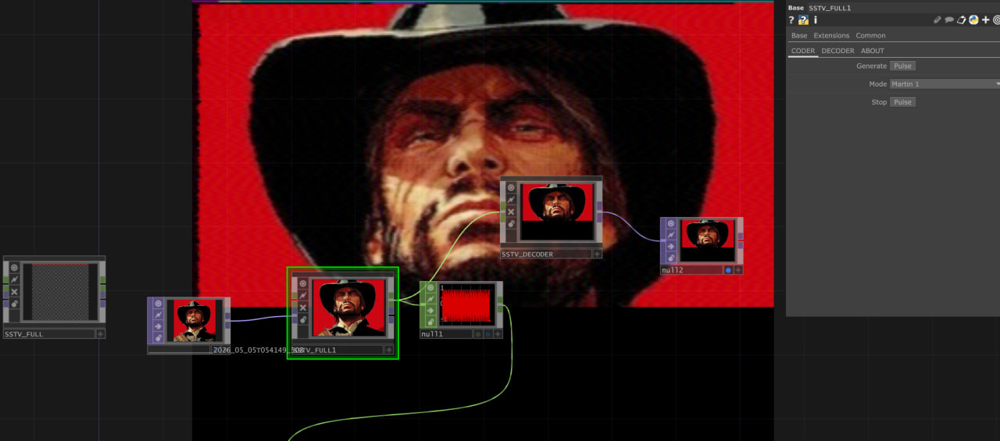
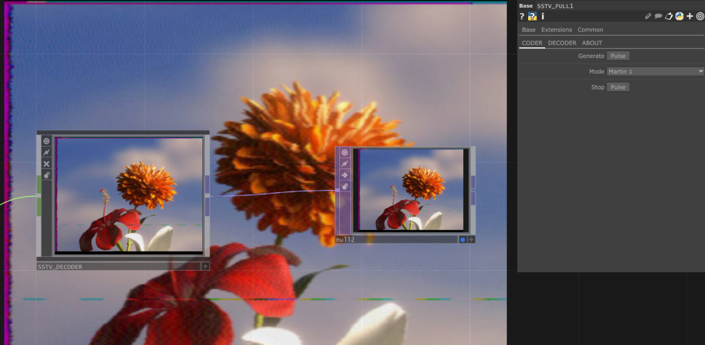

# SSTV Кодер и Декодер для TouchDesigner / SSTV Coder and Decoder for TouchDesigner

> Форк проекта [td-sstv](https://github.com/cinemascop89/td-sstv) by cinemascop89  
> Fork of [td-sstv](https://github.com/cinemascop89/td-sstv) by cinemascop89

---

## RU

Плагин для кодирования и декодирования сигналов [Slow Scan Television (SSTV)](https://en.wikipedia.org/wiki/Slow-scan_television) в TouchDesigner.

- **Кодер** — генерирует SSTV-сигнал из изображения
- **Декодер** — восстанавливает изображение из SSTV-сигнала
- **Объединённый tox** — кодер и декодер в одном компоненте
- Поддержка режимов **Martin 1** и **Martin 2**

## EN

A plugin for encoding and decoding [Slow Scan Television (SSTV)](https://en.wikipedia.org/wiki/Slow-scan_television) signals in TouchDesigner.

- **Coder** — generates an SSTV signal from an image
- **Decoder** — reconstructs an image from an SSTV signal
- **FULL tox** — coder and decoder in a single component
- **Martin 1** and **Martin 2** mode support

---

*by venttt*
